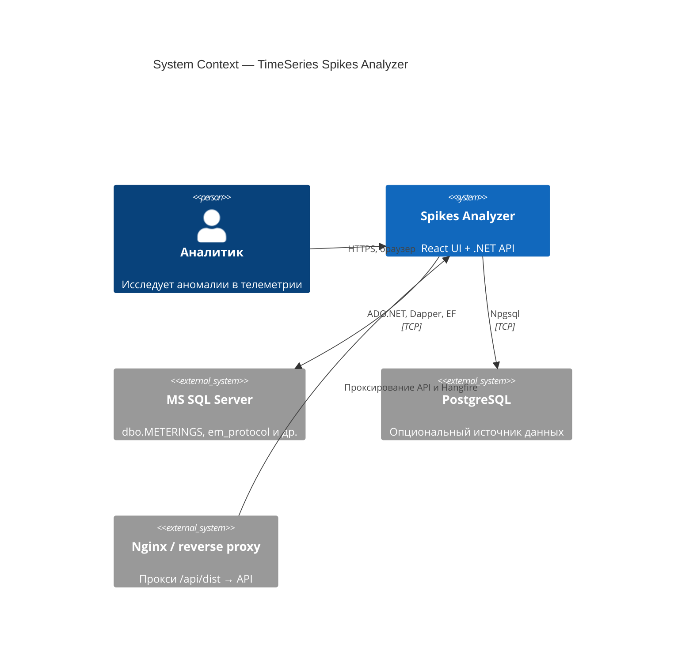

# C4 Level 1 — System Context

## Назначение системы

**Energo-Mir TimeSeries Spikes Analyzer** — веб-приложение для анализа телеметрии энергетических объектов: агрегация временных рядов, детекция аномалий (spikes) и визуализация результатов.

## Диаграмма контекста

## Акторы

| Актор | Описание |
|-------|----------|
| Аналитик | Подключается к БД, выбирает период и гранулярность, запускает анализ, смотрит график и экспортирует Excel |

## Внешние системы

| Система | Роль |
|---------|------|
| MS SQL Server / PostgreSQL | Хранилище сырых записей телеметрии (METERINGS, em_protocol.Records и произвольные таблицы) |
| Nginx | В продакшене: статика фронта, прокси `/api/dist/api` → backend `/api` |

## Границы ответственности backend

Backend **не** отвечает за:

- Рендеринг UI (React/Vite)
- Долгосрочное хранение учётных записей пользователей (сессия — токен в памяти API)
- Репликацию данных телеметрии

Backend **отвечает** за:

- Валидацию подключения к БД и сессии
- Очередь и выполнение анализа (Hangfire)
- ML-детекцию аномалий
- Хранение результатов job (SQLite + JSONL)
- Excel-экспорт
