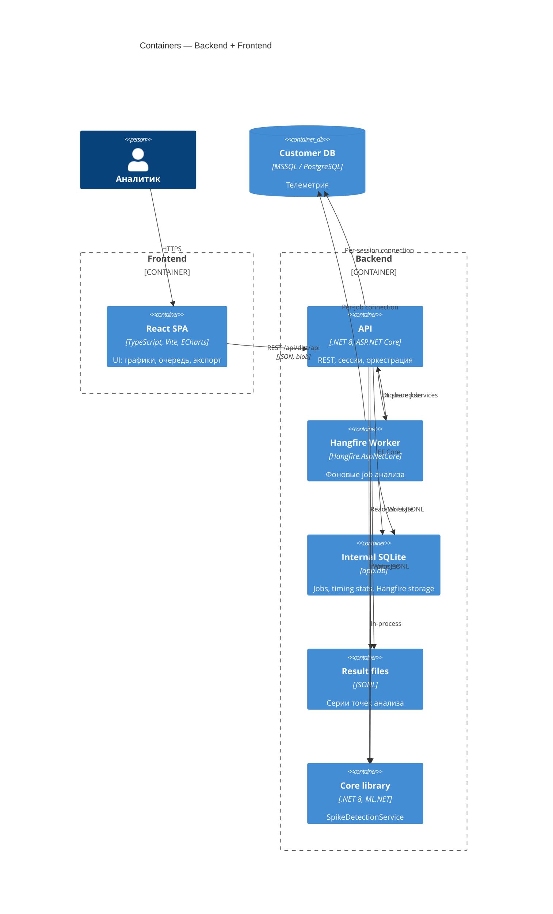
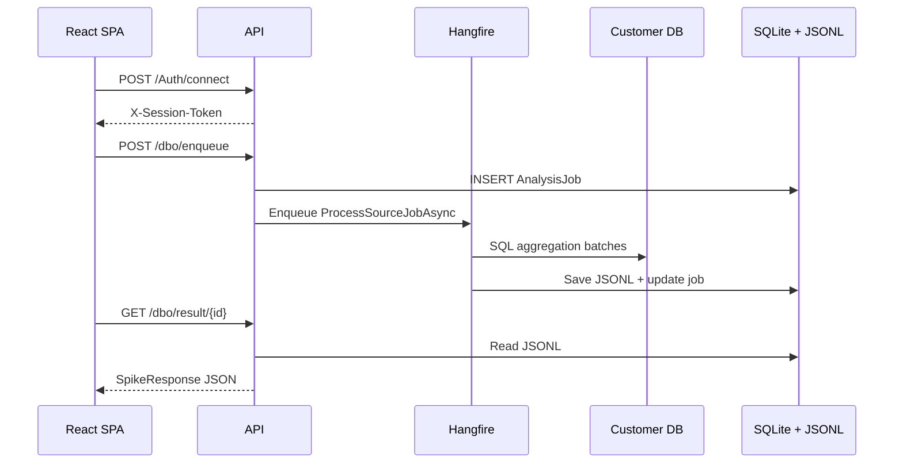

# C4 Level 2 — Containers

## Контейнеры

## Описание контейнеров

### API (`backend/API`)

| Аспект | Детали |
|--------|--------|
| Технология | ASP.NET Core 8, Kestrel :5090 |
| Ответственность | HTTP API, DI, middleware, Hangfire dashboard |
| Хранилища | SQLite (`InternalConnection`), файлы `results/`, `logs/` |

### Core (`backend/Core`)

| Аспект | Детали |
|--------|--------|
| Технология | ML.NET SR-CNN |
| Ответственность | `ISpikeDetectionService` — детекция выбросов по ряду `DataPoint` |
| Зависимости | Не зависит от API |

### Internal SQLite (`app.db`)

Таблицы:

- `AnalysisJobs` — метаданные и статус job (`ProcessedUntil`, `ConnectionFingerprint`, batch metrics)
- `AnalysisSourceTimingStats` — средняя длительность батчей для ETA

### Hangfire SQLite (`hangfire.db`)

Отдельный файл (`HangfireConnection`). Очередь и состояние фоновых задач **не** в `app.db`.

### Result files (`results/`)

- `{jobId}.jsonl` — финальная серия (`AnomalyResultDto` построчно)
- `{jobId}.partial.jsonl` — промежуточная серия (checkpoint / seed для resume)

### Customer DB

Динамическое подключение по сессии. Поддерживаются MSSQL и PostgreSQL через `DatabaseProvider` и `ISqlDialectProvider`.

## Поток данных (контейнерный уровень)

