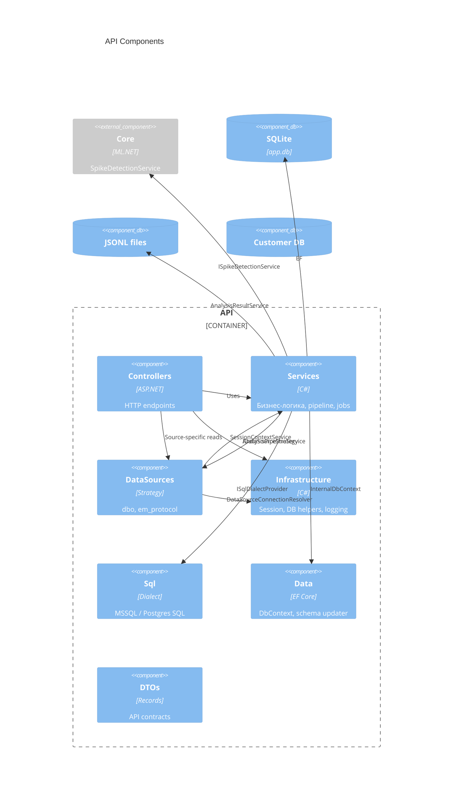

# C4 Level 3 — Components (API)

## Компонентная диаграмма



## Слои

```
HTTP Request
    ↓
Controllers          — маршрутизация, HTTP-коды, валидация входа
    ↓
Services             — оркестрация, job lifecycle, pipeline, export
    ↓
DataSources / Sql    — доступ к данным клиентской БД
    ↓
Core                 — ML spike detection
```

## Controllers (7)

| Controller | Префикс | Назначение |
|------------|---------|------------|
| `AuthController` | `/api/Auth` | Подключение к БД, выдача токена |
| `ExplorerController` | `/api/Explorer` | databases / schemas / tables / columns |
| `SourcesController` | `/api/Sources` | Список зарегистрированных источников |
| `DboController` | `/api/dbo` | dbo.METERINGS: объекты, preview, enqueue, job CRUD |
| `EmProtocolController` | `/api/em-protocol` | em_protocol: каналы, distribution, enqueue, job CRUD |
| `GenericAnalysisController` | `/api/GenericAnalysis` | Произвольные таблицы, enqueue, job CRUD |
| `AnalysisJobsController` | `/api/analysis-jobs` | Очередь, overview, ETA, cancel, **export** |

## Services (ключевые)

| Service | Роль |
|---------|------|
| `AnalysisPipelineService` | SQL-агрегация по батчам, вызов ML, сбор `SpikeResponse` |
| `AnalysisJobProcessor` | Hangfire entry point для generic и source jobs |
| `AnalysisResultService` | JSONL I/O, partial results, `HasResult` / `CanExport` |
| `AnalysisJobQueryService` | **Общая** логика status / result / history / delete |
| `AnalysisJobCoordinatorService` | Overview очереди, cancel, mapping source kind |
| `ExcelReportService` | Шаблон xlsx, заполнение «Данные» (`GenerateReport`) |
| `ExcelChartPatcher` | Post-save patch chart XML (**не используется** в текущем export) |
| `AnalysisExportService` | Оркестратор Excel export (упрощённый: LoadAsync + GenerateReport) |
| `EventCodeLabelService` | Подписи EventCode (зарегистрирован, не используется в export) |
| `ConnectionManagerService` | In-memory сессии `DatabaseSessionInfo` |

## DataSources (Strategy)

```
IDataSourceStrategy
├── DboDataSource        (Id = "Dbo")
└── EmProtocolDataSource (Id = "em_protocol")
```

Регистрация: `AddScoped<IDataSourceStrategy, ...>()` × 2. Резолв в контроллерах через `OfType<T>()`.

## Infrastructure (общие утилиты)

| Класс | Назначение |
|-------|------------|
| `SessionContextService` | `RequireToken()`, `RequireConnection()`, `IsAuthenticated()` |
| `DataSourceConnectionResolver` | Сессия → connection string для DataSources |
| `GranularityHelper` | `GetBucketEnd()` — конец временного интервала |
| `DatabaseConnectionHelper` | `WithDatabase()` — смена каталога в connection string |
| `DatabaseProvider` | Normalize provider, `OpenConnection()` |
| `FileLoggerProvider` | Файловые логи в `logs/` |
| `HangfireDashboardAuthorizationFilter` | Доступ к dashboard |

## Зависимости DI (Program.cs)

| Lifetime | Типы |
|----------|------|
| Singleton | `ISqlDialectProvider`, `IDatabaseContextFactory`, `IConnectionManagerService`, `AnalysisResultService`, `EventCodeLabelService`, `IAnalysisJobCancellationService` |
| Scoped | Pipeline, `ExcelReportService`, Export, DataSources, `SessionContextService`, `AnalysisJobQueryService`, Coordinator, TimingStats |
| Hosted | `StaleAnalysisJobCleanup` |

Удалено из DI: `ITimeSeriesService` / `TimeService` (не использовался — агрегация в SQL pipeline).

## Файловая структура API (целевая)

```
API/
├── Configuration/     # appsettings binding
├── Contracts/         # IConnectionManagerService
├── Controllers/
├── Data/              # EF DbContexts, event_codes.csv
├── DataSources/       # Strategy + table specs
├── DTOs/
├── Infrastructure/    # cross-cutting helpers
├── Models/            # persistence entities + DatabaseSessionInfo
├── Resources/         # ReportTemplate.xlsx
├── Services/          # application services
└── Sql/               # dialect implementations
```

Подробности по каждому модулю — в `docs/modules/`.
