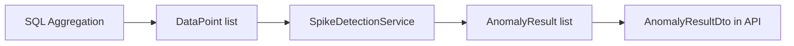

# Core library

Проект `backend/Core/` — доменная логика детекции аномалий, без зависимостей от ASP.NET.

## Структура

```
Core/
├── Enums/
│   └── TimeGranularity.cs
├── Interfaces/
│   ├── ISpikeDetectionService.cs
│   ├── ITimeService.cs          # legacy (ITimeSeriesService)
│   └── IDataLoader.cs          # legacy
├── Models/
│   ├── DataPoint.cs
│   ├── AnomalyResult.cs
│   ├── AggregatedResult.cs
│   ├── Record.cs
│   └── Channel.cs              # unused
└── Services/
    ├── SpikeDetectionService.cs
    ├── TimeService.cs          # unused by API
    └── CSVDataLoader.cs        # unused by API
```

## TimeGranularity

```csharp
Minute, Hour, Day, Week, Month, Custom
```

Используется в API DTOs, pipeline SQL grouping, UI.

## DataPoint

Агрегированная точка временного ряда:

```csharp
DateTime Timestamp;
double Value;
Dictionary<int, int> ChannelBreakdown;  // channelId → count
```

Промежуточный формат между SQL и ML.

## AnomalyResult

Результат ML на одну точку:

```csharp
DateTime Timestamp;
double Value;
bool IsSpike;
double PValue;
```

Маппится в API `AnomalyResultDto` (+ ChannelBreakdown из DataPoint).

## AggregatedResult

Проекция SQL-запроса (ChannelId, ChannelName, Value, Timestamp).

## SpikeDetectionService

**Единственный активный сервис Core в production path.**

Реализует `ISpikeDetectionService` через ML.NET **SrCnnEntireAnomalyDetector**:

1. Принимает `IReadOnlyList<DataPoint>`
2. Строит time series для ML.NET
3. Возвращает `IReadOnlyList<AnomalyResult>` с p-values

Параметры: `confidence` (default 95), `windowSize` (default 30).

Регистрация: `AddScoped<ISpikeDetectionService, SpikeDetectionService>()`.

## Legacy (не используется API)

| Компонент | Причина legacy |
|-----------|------------------|
| `TimeService` / `ITimeSeriesService` | Агрегация перенесена в SQL (`AnalysisPipelineService`) |
| `CSVDataLoader` / `IDataLoader` | Загрузка из CSV не используется в web API |
| `Channel` model | Заменён `ChannelDto` на уровне API |

Файл `ITimeService.cs` содержит интерфейс `ITimeSeriesService` — историческое несоответствие имён.

## Зависимости Core

```xml
<PackageReference Include="Microsoft.ML" />
<PackageReference Include="Microsoft.ML.TimeSeries" />
```

## Поток данных через Core



## Тестирование

Unit-тесты для Core могут вызывать `SpikeDetectionService` с синтетическими `DataPoint` без API/Hangfire.

## Расширение

Замена алгоритма детекции:

1. Новая реализация `ISpikeDetectionService`
2. Смена регистрации в `Program.cs`
3. DTO и pipeline остаются без изменений
