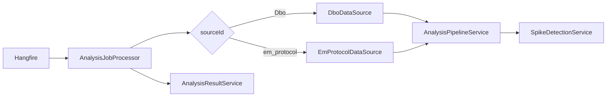

# DataSources

Стратегии доступа к предопределённым схемам телеметрии. Папка: `API/DataSources/`.

## IDataSourceStrategy

```csharp
string Id { get; }           // Hangfire source id: "Dbo", "em_protocol"
string Name { get; }
string[] SupportedDistributions { get; }

Task<SpikeResponse> ExecuteAnalysisAsync(
    DetectSpikesRequest request,
    ISpikeDetectionService spikeDetectionService,
    string connectionString,
    string provider,
    IProgress<int>? progress = null,
    ...);
```

Регистрация: два `AddScoped<IDataSourceStrategy, ...>` в `Program.cs`.

## DboDataSource

| Свойство | Значение |
|----------|----------|
| Id | `Dbo` |
| Schema | `dbo` |
| Table | `METERINGS` |
| Time column | `TIME_INSERT` |
| Channel | `IDOBJECT` → lookup `OBJECTS` |

Дополнительные методы (не в интерфейсе):

- `GetObjectsAsync` — пагинированный список объектов
- `GetObjectDistributionAsync` — распределение по объектам за период
- `GetPointDetailsAsync` — строки METERINGS в bucket
- `GetPointChannelBreakdownAsync` — делегирует pipeline

`OmitDistribution = true` в `AnalysisTableSpec` — distribution считается отдельно.

## EmProtocolDataSource

| Свойство | Значение |
|----------|----------|
| Id | `em_protocol` |
| Table | `em_protocol.Records` |
| Time | `InsertTime` |
| Channel | `ChannelId` → `Channels` (+ EventCode) |

Реализует marker-интерфейсы:

- `ISupportsChannels` — `GetChannelsAsync`
- `ISupportsDistribution` — `GetDistributionAsync` по `EventCode`
- `ISupportsPointChannels`

## AnalysisTableSpec / ChannelLookupSpec

Декларативное описание SQL-источника для `AnalysisPipelineService`:

```csharp
public class AnalysisTableSpec
{
    public string Schema, Table, TimeColumn;
    public string? ChannelColumn, FromClause, TableAlias;
    public ChannelLookupSpec? ChannelLookup;
    public bool OmitDistribution;
}
```

## DataSourceConnectionResolver

Общая логика получения connection string:

1. Если переданы `connectionString` + `provider` (из Hangfire worker) — использовать их.
2. Иначе — `X-Session-Token` → `IConnectionManagerService`.

Инжектируется в оба DataSource вместо дублированного `ResolveConnection`.

## Capability interfaces

| Interface | Назначение | Реализация |
|-----------|------------|------------|
| `ISupportsChannels` | Список каналов | Em only |
| `ISupportsDistribution` | Категориальное распределение | Em only |
| `ISupportsPointChannels` | Breakdown на точке графика | Dbo + Em |

**Будущее улучшение:** полиморфный резолв вместо `OfType<DboDataSource>()` в контроллерах.

## Диаграмма выполнения source job



## Generic tables

Произвольные таблицы **не** реализуют `IDataSourceStrategy`. Они идут напрямую в `AnalysisPipelineService` через `GenericAnalysisController` / `ProcessJobAsync`.
