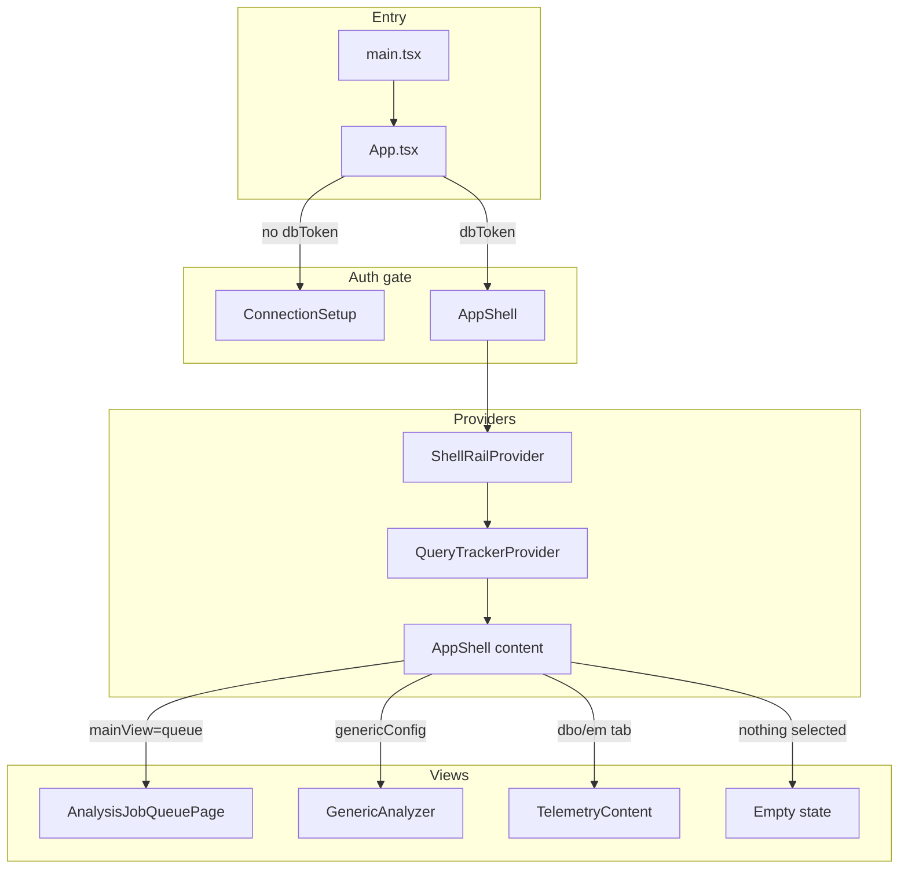
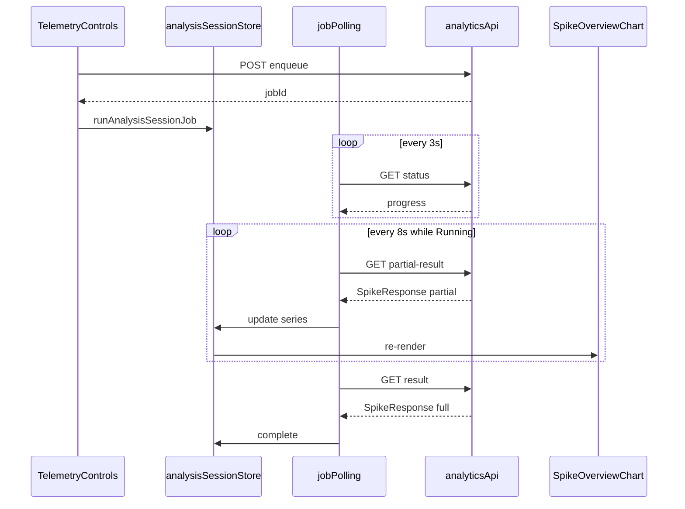

# Architecture

## Обзор

Приложение — single-page без React Router. Навигация реализована через **локальный state** в `AppShell` и условный рендеринг.



## App.tsx

Корневой компонент. Отвечает за:

| Область | Реализация |
|---------|------------|
| Auth gate | `localStorage.dbToken` → `ConnectionSetup` или `AppShell` |
| Theme | `uiTheme` в localStorage, Ant Design `ConfigProvider` |
| Locale | `ru_RU` |
| Primary color | `#3B65D9` |
| Logout | Очистка `dbToken`, `clearAllAnalysisSessions()`, `requestTracker` reset |

**Provider tree (после auth):**

```
ShellRailProvider
  └── QueryTrackerProvider
        └── AppShell
```

## AppShell

Файлы: `layout/AppShell.tsx`, `layout/AppShell.css`.

### View state

| State | Тип | Назначение |
|-------|-----|------------|
| `mainView` | `'analysis' \| 'queue'` | Дашборд анализа или страница очереди |
| `selectedDb` | `string` | Выбранная БД для telemetry |
| `activeTab` | `'dbo' \| 'em'` | Вкладка DBO или EM Protocol |
| `genericConfig` | `{ db, schema, table, timeColumn } \| null` | Generic analyzer |
| `pendingJobOpen` | `PendingAnalysisJobOpen \| null` | Job, открытый из очереди |
| `dbDrawerOpen` | `boolean` | Drawer дерева БД |

### Логика рендеринга контента

```
mainView === 'queue'           → AnalysisJobQueuePage
genericConfig != null          → GenericAnalyzer
selectedDb && activeTab='dbo'  → TelemetryContent (schema dbo)
selectedDb && activeTab='em'   → TelemetryContent (schema em_protocol)
иначе                          → Empty state «Выберите базу данных»
```

### Левая панель (icon rail)

| Иконка | Действие |
|--------|----------|
| Logo | Сброс на analysis dashboard |
| Database | Открыть `DatabaseTreeSidebar` drawer |
| History | Через `ShellRailContext` — регистрируется активным analyzer |
| Queue | Переключение `mainView` |
| Hangfire | `window.open(HANGFIRE_PATH)` |
| Network | Открыть drawer `QueryTracker` |
| Theme | Toggle light/dark |
| Logout | Callback в `App.tsx` |

### Выбор в дереве БД

`DatabaseTreeSidebar` вызывает:

| Выбор | Callback | Результат |
|-------|----------|-----------|
| Schema `dbo` / `em_protocol` | `onSelectStandardSchema` | `TelemetryContent` |
| Колонка времени | `onSelectGenericTable` | `GenericAnalyzer` |

## ShellRailContext

`context/ShellRailContext.tsx` — механизм регистрации действий дочерними feature-компонентами в shell.

| API | Описание |
|-----|----------|
| `ShellRailProvider` | Хранит `actions` |
| `useShellRail()` | Читает `actions`, `registerActions` |
| `useRegisterShellRailActions(actions, enabled)` | Регистрация при mount, очистка при unmount |

Сейчас используется только **`onOpenHistory`** — кнопка History в rail открывает drawer истории анализов.

## QueryTracker

`features/query-tracker/QueryTracker.tsx` — глобальный монитор HTTP.

- `QueryTrackerProvider` подписывается на `requestTracker`
- Axios interceptors в `api/index.ts` вызывают `startRequest` / `endRequest`
- Drawer справа показывает до 200 последних запросов

## Поток анализа (end-to-end)



### Session keys

Каждый analyzer привязан к ключу сессии:

| Контекст | Ключ |
|----------|------|
| DBO telemetry | `telemetry:dbo:{database}` |
| EM telemetry | `telemetry:em:{database}` |
| Generic | `generic:{db}:{schema}:{table}:{timeColumn}` |

Состояние: `{ loading, progress, error, jobId }` + загруженный `SpikeResponse`.

## Темизация

CSS-переменные в `index.css`:

- `--bg-body`, `--text-heading`, `--border-subtle`, …
- Dark mode: `[data-theme='dark']` на корневом элементе

`AppShell.css` — layout shell, sidebar, KPI cards, charts, queue tables.

## Статические ресурсы

| Файл | Назначение |
|------|------------|
| `public/event_codes.csv` | Расшифровка EventCode для EM (загружается в runtime) |
| `public/favicon.png` | Favicon |
| `index.html` | Шрифты Manrope, JetBrains Mono |

## Vite config

```ts
base: production ? '/dist/' : '/'
server.host: '127.0.0.1'
proxy:
  /api/dist/hangfire → localhost:5090
  /api/dist/api      → localhost:5090 (rewrite /api/dist/api → /api)
```

## TypeScript

`tsconfig.app.json`: target ES2023, strict, `noEmit: true` (Vite bundler).
