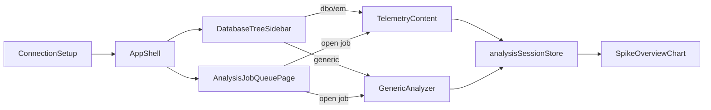

# Features

Описание экранов и бизнес-логики в `src/features/`.

## ConnectionSetup

**Путь:** `features/connection/ConnectionSetup.tsx`

Экран до авторизации. Показывается когда `localStorage.dbToken` отсутствует.

### Поля формы

| Поле | Тип | По умолчанию |
|------|-----|--------------|
| Provider | `mssql` \| `pgsql` | `mssql` |
| Host | string | — |
| Port | number | 1433 (mssql) |
| Database | string? | опционально |
| Username | string | — |
| Password | password | — |

### Flow

1. Submit → `authApi.connect(body)`
2. Success → `localStorage.setItem('dbToken', res.token)`
3. `onConnected()` → `App` переключается на `AppShell`

Ошибки отображаются через Ant Design `message.error`.

---

## DatabaseTreeSidebar

**Путь:** `features/explorer/DatabaseTreeSidebar.tsx`

Drawer с ленивым деревом БД (Ant Design `Tree`).

### Структура дерева

```
Database
  └── Schema
        └── Table
              └── Column (isTimeColumn → зелёная иконка)
```

### Загрузка

| Уровень | API |
|---------|-----|
| Root | `explorerApi.getDatabases()` |
| Database | `getSchemas(database)` |
| Schema | `getTables(database, schema)` |
| Table | `getColumns(database, schema, table)` |

### Выбор

| Элемент | Визуал | Callback |
|---------|--------|----------|
| Schema `dbo` / `em_protocol` | Синяя папка | `onSelectStandardSchema(db, schema)` |
| Колонка времени | `FieldTimeOutlined` | `onSelectGenericTable(db, schema, table, timeColumn)` |

Фильтр по имени БД вверху drawer.

---

## TelemetryContent

**Путь:** `features/telemetry/TelemetryContent.tsx`

Основной анализатор для стандартных схем **dbo** (`dbo.METERINGS`) и **em_protocol** (`em_protocol.Records`).

### Props

| Prop | Описание |
|------|----------|
| `database` | Имя БД |
| `activeTab` | `'dbo'` \| `'em'` |
| `pendingJobOpen` | Job из очереди для автозагрузки |
| `onPendingJobConsumed` | Callback после обработки pending |

### Session key

```
telemetry:{activeTab}:{database}
```

### Состояние UI

| State | Описание |
|-------|----------|
| `granularity` | `TimeGranularity` |
| `customMinutes` | Для Custom granularity |
| `windowSize` | 10–100 |
| `confidence` | 80–99% |
| `dateRange` | `[start, end]` dayjs |
| `channelFilter` | ID объекта/канала или null |
| `showAvgLine`, `showMaxLine`, … | Toggles маркеров на графике |
| `tablePreviewOpen` | Показ preview таблицы |

### Анализ

1. `confirmHeavyAnalysis()` если оценка ≥ 100k точек (`granularityWarning`)
2. `enqueueAnalysis` с `DetectSpikesRequest`
3. `runAnalysisSessionJob(sessionKey, jobId, api)`
4. Partial results стримятся на график
5. On complete: EM — загрузка distribution charts; DBO — optional object distribution

### API по вкладке

| Вкладка | Enqueue / status / result | Справочники |
|---------|--------------------------|-------------|
| dbo | `analyticsApi.dbo` | `getObjects`, `getObjectDistribution` |
| em | `analyticsApi.emProtocol` | `getChannels`, `getDistribution` |

### Point detail drawer

Клик по точке на графике:

- **dbo:** `getPointDetails` → таблица metering rows
- **em:** `getPointChannels` → breakdown по каналам

### История

`useAnalysisHistory` — drawer со списком прошлых job, удаление, повторное открытие.

Регистрирует `onOpenHistory` в shell rail.

### Reopen from queue

`pendingJobOpen` → `loadAnalysisJobResult` → восстановление параметров и результата.

---

## GenericAnalyzer

**Путь:** `features/generic-analyzer/GenericAnalyzer.tsx`

Анализ произвольной таблицы с колонкой времени.

### Props

```ts
{ database, schema, table, timeColumn, pendingJobOpen?, onPendingJobConsumed? }
```

### Session key

```
generic:{database}:{schema}:{table}:{timeColumn}
```

### Отличия от TelemetryContent

| Аспект | Generic |
|--------|---------|
| API | `genericAnalysisApi` |
| Channel filter | Нет (пустой список в `TelemetryControls`) |
| Distribution charts | Нет |
| Point details | Динамические колонки из API response |
| Anomaly list | Только если `stats.spikesCount > 0` |
| Estimate schema/table | Реальные schema + table |

Остальной UI (KPI, график, controls, progress, history, export) — тот же паттерн.

---

## AnalysisJobQueue

**Путь:** `features/queue/AnalysisJobQueue.tsx`, `AnalysisJobQueuePage.tsx`

### Polling

`analysisJobsApi.getOverview()` каждые **3 секунды**.

### Таблицы

| Секция | Данные |
|--------|--------|
| Active | `overview.active` — Running/Pending |
| Recent | `overview.recent` — завершённые |

### Действия

| Действие | Условие | API |
|----------|---------|-----|
| Cancel | status Running/Pending | `analysisJobsApi.cancel` |
| Open | `canOpenAnalysisJob(item)` | callback `onOpenJob` |

### canOpenAnalysisJob

```ts
(Completed && hasResult) ||
(Cancelled && hasPartialResult) ||
(Running && hasPartialResult)
```

### Open job flow

`AnalysisJobQueuePage` → `AppShell.setPendingJobOpen` → соответствующий analyzer загружает результат.

---

## QueryTracker

**Путь:** `features/query-tracker/QueryTracker.tsx`

Dev/debug инструмент — список HTTP-запросов в правом drawer.

| Поле записи | Описание |
|-------------|----------|
| `url`, `method` | Запрос |
| `startTime`, `endTime` | Timestamps |
| `status` | HTTP code или error |
| `errorMessage` | Текст ошибки |

Максимум **200** записей в `requestTracker`.

Кнопка в shell rail показывает badge с числом активных запросов.

---

## Взаимодействие features



---

## Общие паттерны features

### TelemetryControls integration

Все analyzers передают в `TelemetryControls`:

- Параметры анализа и callbacks
- `onAnalyze`, `onCancel`, `onExport`
- `durationHint` из `useDurationEstimate`
- `tablePreview` из `useTablePreview`

### AnalysisJobProgress

Показывается при `loading` из session store:
- Progress bar
- Cancel button
- Alert при partial results

### Export menu

`TelemetryControls` → dropdown:
- «Скачать Excel»
- «С распределением из БД» (`loadDistribution=true`)

На текущем backend оба варианта дают одинаковый файл.
