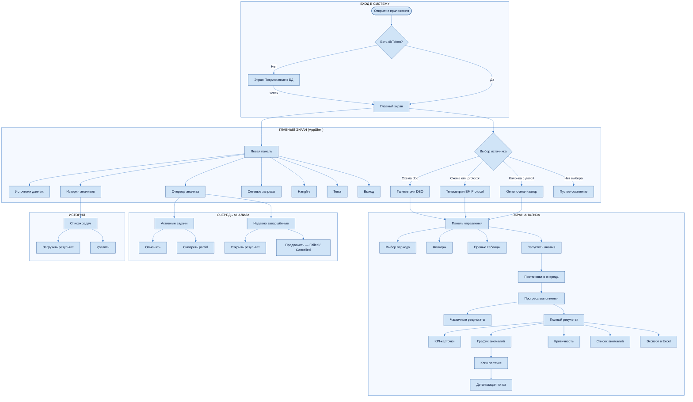
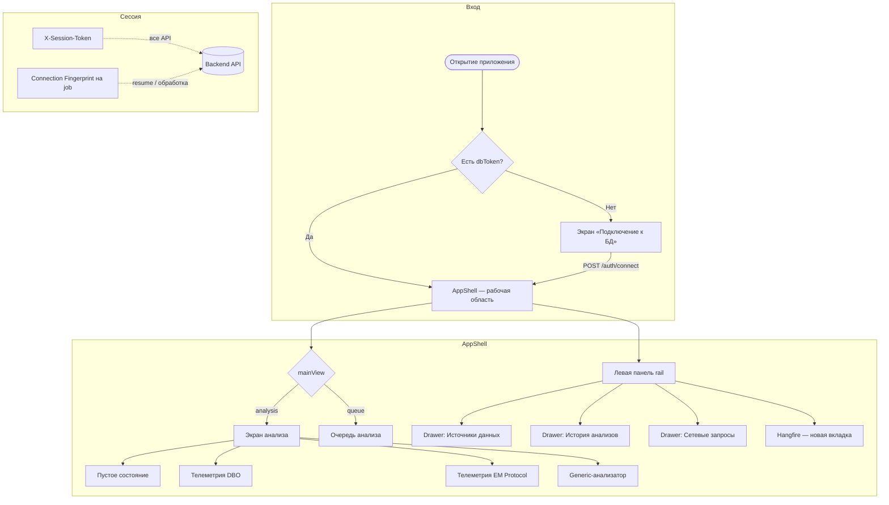
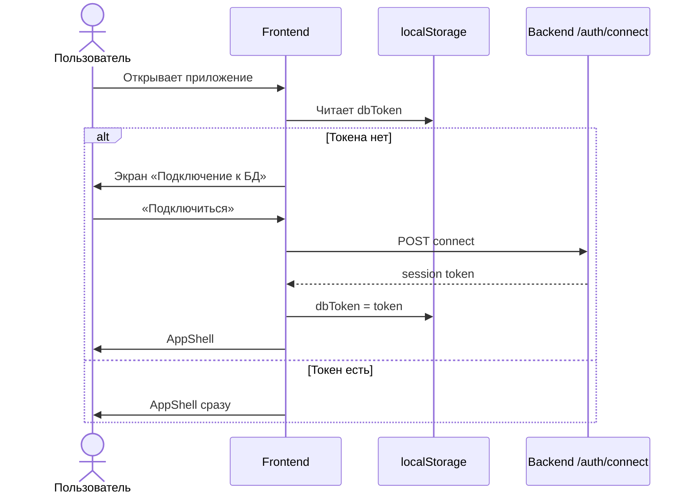
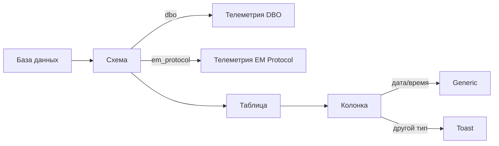
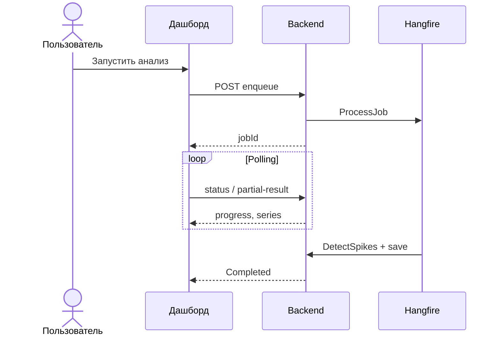
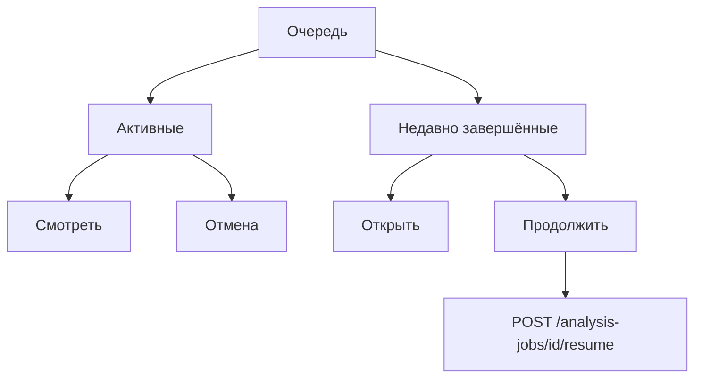
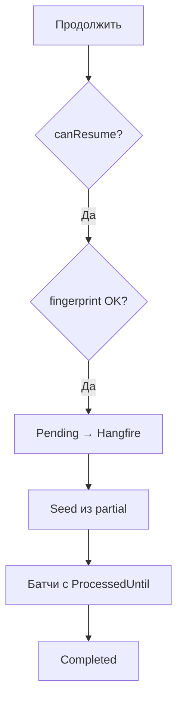

# Пользовательский путь: Energo-Mir TimeSeries Spikes Analyzer

Приложение — **SPA без URL-маршрутов**. Экраны переключаются состоянием в `AppShell`. Все запросы к API идут с заголовком **`X-Session-Token`** (токен из `localStorage.dbToken`).

---

## Обзорная карта (Mermaid)

> Очередь — полноэкранная страница (`mainView = queue`), не drawer. Resume доступен при `canResume` (Failed / Cancelled / Pending с checkpoint).

---

## 1. Общая карта (техническая)

---

## 2. Подключение к базе данных

1. Нет `dbToken` → экран **«Подключение к БД»**.
2. Хост, порт, user, password, СУБД → `POST /api/auth/connect`.
3. Токен в `localStorage.dbToken` → `AppShell`.
4. После рестарта API токен недействителен → 401 → снова экран входа.

---

## 3. Выбор источника данных

| Выбор в дереве | Экран |
|----------------|-------|
| Схема `dbo` | Телеметрия DBO |
| Схема `em_protocol` | Телеметрия EM Protocol |
| Колонка дата/время | Generic-анализатор |
| Колонка не дата/время | Toast с ошибкой |

---

## 4. Запуск анализа

1. Период, фильтры, (опционально) превью.
2. **Запустить анализ** → enqueue (`/dbo|em-protocol|GenericAnalysis/enqueue`).
3. Polling: status 3 с, partial 8 с (пока вкладка видима).
4. Partial → график по батчам; Completed → KPI, donut, список, Excel.

---

## 5. Очередь анализа

| Действие | Условие |
|----------|---------|
| Смотреть | Running + partial |
| Открыть | Completed + result / Cancelled + partial |
| Стоп / Отмена | Pending / Running |
| Продолжить | `canResume === true` |

---

## 6. Resume и Seed

**canResume:** Failed / Pending / Cancelled + `ProcessedUntil` + (partial **или** `CompletedBatchCount > 0`).

| | Назначение |
|---|------------|
| `ProcessedUntil` | Курсор: с какой даты продолжать батчи |
| `SeedSeries` | Ряд из `{id}.partial.jsonl` до курсора |

Fingerprint текущего подключения должен совпасть с job.

---

## 7. Сводная таблица путей

| # | Путь | Старт → Финиш |
|---|------|---------------|
| A | Вход | Подключение → AppShell |
| B | DBO / EM / Generic | Источник → анализ → результат |
| C | Отмена | Остановить → Cancelled + checkpoint |
| D | Resume | Продолжить → Completed |
| E | Очередь | Обзор / открыть / отмена / resume |
| F | Excel | Завершённый job → .xlsx |
| G | Logout / 401 | Снова подключение |

---

## Связанная документация

- [Архитектура frontend](./architecture.md)
- [API-клиент](./api-client.md)
- [Фичи и экраны](./features.md)
- [Backend API reference](../../backend/docs/api-reference.md)
